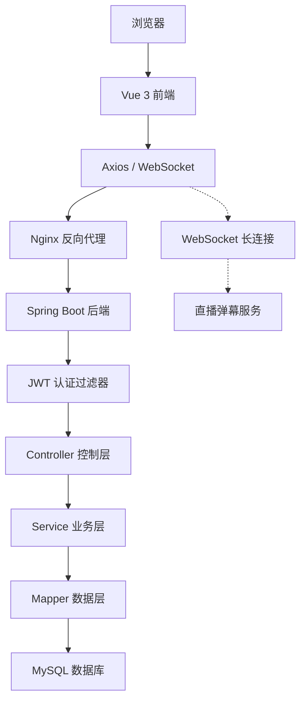

在完成对在线教育平台需求的全面分析后，接下来的工作重心转向如何将这些需求转化为具体的技术方案。系统设计是整个软件开发过程中的关键环节，它决定了系统的整体结构、技术选型以及各组成部分之间的协作方式。一个良好的设计不仅能够确保系统功能的完整实现，还能为后续的编码、测试和维护工作奠定坚实的基础。本章将从宏观到微观，依次展开对在线教育平台的体系架构设计。首先，通过前后端分离架构描绘出系统的整体技术蓝图；其次，深入探讨后端三层逻辑架构与前端组件化架构，明确数据流与控制流；最后，将依据需求分析结果，详细规划系统的四大功能模块划分，形成清晰的功能架构图，从而为下一阶段的数据库设计与详细功能实现提供明确的指导蓝图。

## 整体架构设计

本系统采用前后端分离的 B/S 架构模式，将前端展示与后端业务逻辑解耦，两者通过 HTTP/HTTPS 协议以 JSON 格式进行数据交换。前端基于 Vue 3 框架构建单页面应用，运行在浏览器端，负责页面渲染、用户交互和路由管理；后端基于 Spring Boot 3 框架构建 RESTful API 服务，运行在服务器端，负责业务逻辑处理、数据持久化和身份认证。前后端之间通过 Nginx 或 Vite 开发服务器进行反向代理转发，有效隔离前端静态资源与后端 API 接口，降低系统的耦合度，提高可维护性和可扩展性。

在技术组件层面，前端采用 Vite 作为构建工具，实现快速的模块热更新和打包优化；Element Plus 组件库提供统一美观的 UI 界面；Pinia 负责全局状态管理，存储用户信息和认证令牌；Vue Router 管理前端路由并配合路由守卫实现页面级权限控制；Axios 作为 HTTP 客户端，通过请求拦截器自动注入 JWT 令牌，通过响应拦截器统一处理错误。后端采用 Spring Security 结合 JWT 实现无状态认证，JwtAuthFilter 作为请求过滤器链的关键环节，在每个请求到达控制层之前完成令牌校验和用户身份注入；MyBatis-Plus 作为 ORM 框架，简化数据库操作并支持分页查询和条件构造；MySQL 8.0 作为关系型数据库，承担所有业务数据的持久化存储；WebSocket 协议单独建立长连接通道，支撑直播弹幕等实时双向通信场景。

**图1 系统整体架构图**

整个系统的数据流可概括为：用户通过浏览器访问前端页面，前端根据用户操作发起 HTTP 请求，经过 Nginx/Vite 代理转发至后端对应控制器，控制器调用业务逻辑层处理请求并通过数据访问层操作数据库，处理结果以统一 JSON 格式返回前端，前端解析数据后更新视图呈现给用户。实时通信场景下，前端直接与后端 WebSocket 端点建立连接，双向推送消息数据。
