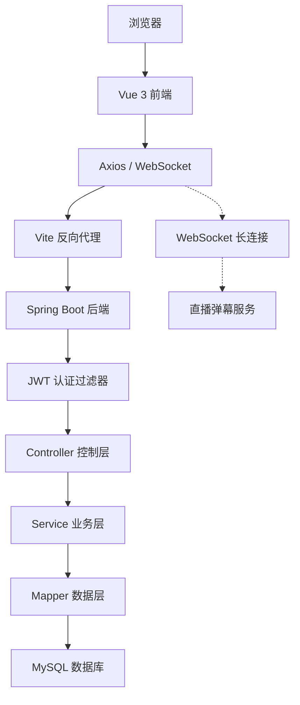
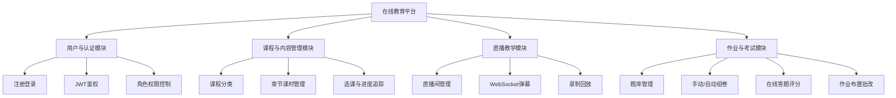
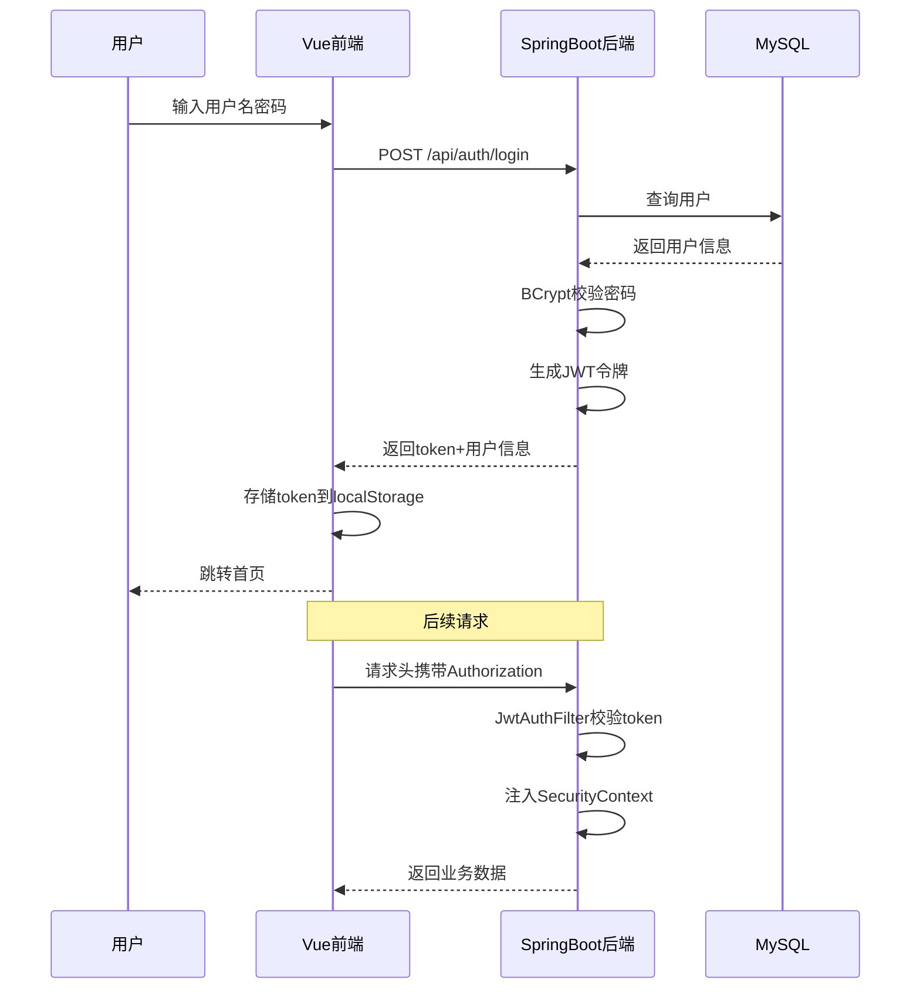

# 在线教育平台 课程设计报告

## 封面信息

| 项目 | 内容 |
|------|------|
| 课程名称 | Web全栈开发 |
| 设计名称 | 基于Spring Boot的在线教育平台的设计与实现 |
| 专业班级 | （填写） |
| 学号 | （填写） |
| 姓名 | （填写） |
| 任课教师 | （填写） |
| 日期 | 2026-06-25 |

---

## 第1章 选题说明

随着互联网技术的快速发展，在线教育已成为现代教育体系的重要组成部分。传统的线下教学模式受限于时间和空间，难以满足学习者多样化和个性化的需求。因此，本项目选择开发一个功能完善的在线教育平台，旨在为教师和学生提供一个集课程学习、直播教学、作业考核于一体的综合性教学环境。

**选题背景**

近年来，在线教育市场规模持续增长，尤其是在远程办公和在线学习需求激增的背景下，教育信息化已成为必然趋势。然而，现有的在线教育平台往往功能单一、操作复杂，缺乏对教学全流程的有效支撑。本项目从实际教学场景出发，覆盖"教、学、练、考"四个环节，力求构建一个完整的在线教学闭环。

**功能定位**

本平台设计了四大功能模块：用户与认证模块实现注册登录、JWT 鉴权和角色权限控制，区分学生、教师、管理员三类用户；课程与内容管理模块支持课程分类、章节课时管理、选课与学习进度追踪；直播教学模块基于 WebSocket 实现实时弹幕互动，支持推拉流和录制回放；作业与考试模块涵盖题库管理、自动组卷、在线答题、自动评分和作业提交评分功能。四个模块由两人分工协作完成，覆盖了在线教育平台的核心业务场景。

**技术选型**

后端采用 Spring Boot 3 框架，结合 MyBatis-Plus 实现高效的数据持久化操作，使用 Spring Security 与 JWT 实现无状态用户认证；前端采用 Vue 3 框架和 Element Plus 组件库，使用 Pinia 管理全局状态，通过 Axios 与后端进行数据交互；数据库采用 MySQL 8.0，设计了十六张数据表，完整覆盖四大模块的数据存储需求。

**选题意义**

本项目的开发不仅是对主流前后端分离架构的一次完整实践，也深入探索了在线教育场景下的关键技术点，包括 RBAC 权限控制、WebSocket 实时通信、自动组卷算法、自动评分逻辑等。通过本项目，团队成员分别锻炼了不同业务模块的分析与开发能力，积累了完整的软件工程实践经验。

---

## 第2章 系统设计

在完成对在线教育平台需求的全面分析后，接下来的工作重心转向如何将这些需求转化为具体的技术方案。系统设计是整个软件开发过程中的关键环节，它决定了系统的整体结构、技术选型以及各组成部分之间的协作方式。一个良好的设计不仅能够确保系统功能的完整实现，还能为后续的编码、测试和维护工作奠定坚实的基础。本章将从宏观到微观，依次展开对在线教育平台的体系架构设计。首先，通过前后端分离架构描绘出系统的整体技术蓝图；其次，深入探讨后端三层逻辑架构与前端组件化架构，明确数据流与控制流；最后，将依据需求分析结果，详细规划系统的四大功能模块划分，形成清晰的功能架构图，从而为下一阶段的数据库设计与详细功能实现提供明确的指导蓝图。

### 2.1 体系架构设计

#### 2.1.1 整体架构设计

本系统采用前后端分离的 B/S 架构模式，将前端展示与后端业务逻辑解耦，两者通过 HTTP 协议以 JSON 格式进行数据交换。前端基于 Vue 3 框架构建单页面应用，运行在浏览器端，负责页面渲染、用户交互和路由管理；后端基于 Spring Boot 3 框架构建 RESTful API 服务，运行在服务器端，负责业务逻辑处理、数据持久化和身份认证。前后端之间通过 Vite 开发服务器进行反向代理转发，有效隔离前端静态资源与后端 API 接口，降低系统的耦合度，提高可维护性和可扩展性。

在技术组件层面，前端采用 Vite 作为构建工具，Element Plus 提供统一美观的 UI 界面，Pinia 负责全局状态管理，Vue Router 配合路由守卫实现页面级权限控制，Axios 通过拦截器自动注入 JWT 令牌。后端采用 Spring Security 结合 JWT 实现无状态认证，JwtAuthFilter 在每个请求到达控制层之前完成令牌校验；MyBatis-Plus 作为 ORM 框架简化数据库操作；MySQL 8.0 承担所有业务数据的持久化存储；WebSocket 协议支撑直播弹幕等实时双向通信。

整个系统的数据流为：用户通过浏览器访问前端 → 前端发起 HTTP 请求 → Vite 代理转发至后端 Controller → Service 处理业务逻辑 → Mapper 操作数据库 → 结果以 JSON 返回前端 → 前端更新视图。实时通信场景下，前端直接与后端 WebSocket 端点建立长连接。

整体架构设计图如图2-1所示。

> **图2-1 整体架构设计图**（见下方 Mermaid 图）



#### 2.1.2 功能架构设计

本系统的功能架构以在线教育平台的核心需求为出发点，划分为四个相互独立又有机联系的功能模块。用户与认证模块负责对平台所有用户进行注册、登录与身份管理，采用 JWT 令牌实现无状态鉴权，并基于 RBAC 模型区分学生、教师、管理员三类角色的操作权限，为整个平台提供可靠的身份认证与访问控制基础。课程与内容管理模块主要处理课程从创建到交付的完整流程，支持课程分类、课程发布与编辑、章节课时编排以及用户选课与学习进度追踪，确保教学内容能够以结构化的方式呈现给学习者，构成平台的内容核心。直播教学模块构建了一个师生实时互动的线上空间，支持教师创建直播房间、配置推拉流地址，并基于 WebSocket 协议实现多房间弹幕聊天与录制回放功能，增强在线教学的临场感与互动性。作业与考试模块提供从题库建设到在线考核的全流程教学辅助功能，支持单选、多选、判断、填空、简答五种题型的录入与管理，教师可手动选题或设定规则自动组卷，学生在线答题后系统对客观题进行自动评分并记录成绩，同时支持作业的布置、提交与教师批改评语，形成完整的教学考核闭环。这四个模块通过用户体系与课程数据相互关联，共同构成从"教"到"学"再到"练"与"考"的完整业务闭环。

功能架构设计图如图2-2所示。

> **图2-2 功能架构设计图**



### 2.2 功能详细设计

功能详细设计是软件开发中的关键步骤，它在系统需求分析的基础上，对各项功能做进一步的细化与实现规划。此阶段需结合用户实际需求，深入分析系统的具体功能、业务规则及操作流程，为后续开发和功能落地提供依据。合理的模块划分不仅能提升系统开发效率，也有助于增强系统的可维护性与可扩展性。

#### 2.2.1 用户与认证模块

用户与认证模块是整个平台的基础，承担着用户注册、登录认证与权限控制的核心职责。该模块主要包含三项子功能：用户注册与登录、JWT 令牌管理、角色权限控制。

用户注册时提交用户名、密码等基本信息，密码经 BCrypt 加密后存入数据库。登录时系统校验用户名和密码，校验通过后生成 accessToken（30分钟有效）和 refreshToken（7天有效），前端将 token 存入 localStorage，后续请求通过 Axios 拦截器自动在请求头携带 token。后端 JwtAuthFilter 拦截每个请求，解析 token 并注入 Spring Security 上下文，SecurityConfig 根据请求方法和 URL 路径判断角色权限。

用户认证流程图如图2-3所示。

> **图2-3 用户认证流程图**



#### 2.2.2 课程与内容管理模块

课程与内容管理模块是平台的内容核心，负责课程从创建到学习的完整流程。该模块包含课程分类管理、课程 CRUD、章节课时管理和选课进度追踪四项子功能。

课程采用四层数据结构：分类（Category）→ 课程（Course）→ 章节（Chapter）→ 课时（Section）。教师创建课程后添加章节和课时，课时支持视频和文档两种类型，可设置免费试学。用户选课后，系统通过 user_course 表记录选课关系，通过 user_lesson_progress 表追踪每个课时的学习状态。课程整体进度由已完成课时数占总课时数的比例计算。

#### 2.2.3 作业与考试模块

作业与考试模块是平台的教学考核核心，包含题库管理、考试管理和作业管理三项子功能。

题库管理支持单选、多选、判断、填空、简答五种题型，选择题选项以 JSON 格式存储。考试管理支持手动选卷和自动组卷两种方式：手动选卷由教师从题库中逐题挑选；自动组卷由教师设定题型数量、分值和难度等级，系统通过随机抽题算法从题库中抽取题目组成试卷。学生进入考试后启动计时，客观题在提交时自动评分，对比用户答案与正确答案。作业管理支持教师布置作业、设置截止时间，学生在线提交内容或附件，教师查看提交并打分评语。

---

## 第3章 系统实现

系统使用 Spring Boot 3 和 Vue 3 框架，实现前后端分离。前端使用 Vue 3 框架和 Element Plus 组件库相结合，后端使用 Spring Boot 3 编写独立的 RESTful API 服务。完成了四大模块核心业务逻辑的开发与集成，确保系统功能完整、操作流畅、数据准确，为用户提供良好的在线教学与学习体验。

### 3.1 用户认证实现

用户认证是本系统的基础功能，实现了从注册、登录到请求拦截的完整流程。AuthController 接收登录请求，调用 UserService 校验用户信息并生成 JWT 令牌返回前端。前端 Axios 请求拦截器将 token 注入每个请求的 Authorization 头，后端 JwtAuthFilter 解析 token 并建立安全上下文。核心代码如下：

```java
// AuthController — 登录接口
@PostMapping("/login")
public Result<?> login(@RequestBody LoginRequest req) {
    User user = userService.findByUsername(req.getUsername());
    if (user == null || user.getStatus() == 0) {
        return Result.fail(401, "用户名不存在或账号已禁用");
    }
    if (!passwordEncoder.matches(req.getPassword(), user.getPassword())) {
        return Result.fail(401, "密码错误");
    }
    String accessToken = jwtTokenProvider.generateAccessToken(
        user.getId(), user.getUsername(), user.getRole());
    String refreshToken = jwtTokenProvider.generateRefreshToken(
        user.getId(), user.getUsername());
    Map<String, Object> data = new HashMap<>();
    data.put("accessToken", accessToken);
    data.put("refreshToken", refreshToken);
    data.put("userId", user.getId());
    data.put("username", user.getUsername());
    data.put("role", user.getRole());
    return Result.ok(data);
}

// JwtTokenProvider — 令牌生成
public String generateAccessToken(Long userId, String username, String role) {
    Map<String, Object> claims = new HashMap<>();
    claims.put("userId", userId);
    claims.put("role", role);
    return buildToken(claims, username, accessTokenExpiration);
}

private String buildToken(Map<String, Object> claims, String subject, long exp) {
    Date now = new Date();
    return Jwts.builder()
            .claims(claims)
            .subject(subject)
            .issuedAt(now)
            .expiration(new Date(now.getTime() + exp))
            .signWith(key)
            .compact();
}

// SecurityConfig — 权限拦截
@Bean
public SecurityFilterChain filterChain(HttpSecurity http) throws Exception {
    http.csrf(AbstractHttpConfigurer::disable)
        .sessionManagement(s ->
            s.sessionCreationPolicy(SessionCreationPolicy.STATELESS))
        .authorizeHttpRequests(auth -> auth
            .requestMatchers("/api/auth/**").permitAll()
            .requestMatchers(HttpMethod.GET, "/api/courses/**").permitAll()
            .requestMatchers("/ws/**").permitAll()
            .requestMatchers("/api/admin/**").hasRole("ADMIN")
            .requestMatchers(HttpMethod.POST, "/api/exams").hasAnyRole("TEACHER", "ADMIN")
            .anyRequest().authenticated())
        .addFilterBefore(jwtAuthFilter,
            UsernamePasswordAuthenticationFilter.class);
    return http.build();
}
```

### 3.2 课程管理实现

课程管理实现了课程 CRUD、章节课时编排和选课功能。CourseController 处理课程相关请求，CourseService 封装课程创建、更新、查询和删除逻辑。课程查询支持按分类和关键词筛选，使用 MyBatis-Plus 分页插件实现分页返回。核心代码如下：

```java
// CourseController — 课程分页查询
@GetMapping("/courses")
public Result<?> listCourses(
        @RequestParam(defaultValue = "1") Integer page,
        @RequestParam(defaultValue = "10") Integer size,
        @RequestParam(required = false) Long categoryId,
        @RequestParam(required = false) String keyword) {
    return Result.ok(PageResult.from(
        courseService.listCourses(page, size, categoryId, keyword)));
}

// CourseService — 查询逻辑
public Page<Course> listCourses(Integer page, Integer size,
                                 Long categoryId, String keyword) {
    LambdaQueryWrapper<Course> wrapper = new LambdaQueryWrapper<Course>()
        .eq(categoryId != null, Course::getCategoryId, categoryId)
        .like(StringUtils.hasText(keyword), Course::getTitle, keyword)
        .orderByDesc(Course::getCreatedAt);
    return courseMapper.selectPage(new Page<>(page, size), wrapper);
}
```

### 3.3 考试功能实现

考试功能实现了开始考试和提交考试两个核心流程。startExam 方法校验考试状态和重考次数后创建考试记录，submitExam 方法接收用户答案，逐题比对正确答案实现自动评分，客观题正确得分、错误零分。核心代码如下：

```java
// ExamService — 提交考试并自动评分
@Transactional
public ExamRecord submitExam(Long recordId, Long userId,
                              List<Map<String, Object>> answers) {
    ExamRecord record = examRecordMapper.selectById(recordId);
    if (record == null || !record.getUserId().equals(userId)) {
        throw new BusinessException(403, "无权操作");
    }
    if (!"IN_PROGRESS".equals(record.getStatus())) {
        throw new BusinessException(400, "该试卷已提交");
    }
    int totalScore = 0;
    for (Map<String, Object> ans : answers) {
        Long questionId = Long.valueOf(ans.get("questionId").toString());
        String userAnswer = (String) ans.get("answer");
        Question question = questionMapper.selectById(questionId);
        boolean correct = false;
        int score = 0;
        if (question != null && question.getAnswer() != null) {
            String correctAnswer = question.getAnswer().trim();
            String supplied = userAnswer != null ? userAnswer.trim() : "";
            correct = correctAnswer.equalsIgnoreCase(supplied);
            score = correct ? question.getScore() : 0;
            totalScore += score;
        }
        ExamAnswer examAnswer = new ExamAnswer();
        examAnswer.setRecordId(recordId);
        examAnswer.setQuestionId(questionId);
        examAnswer.setUserAnswer(userAnswer);
        examAnswer.setIsCorrect(correct ? 1 : 0);
        examAnswer.setScore(score);
        examAnswerMapper.insert(examAnswer);
    }
    record.setScore(totalScore);
    record.setStatus("SUBMITTED");
    record.setSubmitTime(LocalDateTime.now());
    examRecordMapper.updateById(record);
    return record;
}
```

---

## 结论

本研究围绕在线教育平台的设计与实现展开，针对传统线下教学受限于时空、现有平台功能单一等问题，提出了一套集课程学习、直播教学、作业考试于一体的综合性解决方案。系统采用前后端分离架构，后端基于 Spring Boot 3 和 MyBatis-Plus，前端基于 Vue 3 和 Element Plus，结合 JWT 认证和 WebSocket 实时通信，实现了用户认证、课程管理、直播教学、作业考试四大功能模块，覆盖了"教、学、练、考"的完整教学闭环。

在功能实现方面，系统完整覆盖了从用户注册登录、课程浏览选课、直播弹幕互动到在线答题评分的全链条需求。用户与认证模块为平台提供可靠的身份认证基础，课程与内容管理模块构建了完整的内容组织体系，直播教学模块实现了师生实时互动，作业与考试模块形成了闭环的考核评估机制。各模块协同运作，形成"输入—处理—输出—反馈"的良性生态。测试结果表明，所有功能均按预期运行，界面友好，操作流畅，能够满足在线教育场景的基本使用需求。

尽管本系统已实现预期目标，但仍存在进一步优化空间。未来可引入视频转码与流媒体分发技术提升直播体验，接入短信或邮箱验证增强账户安全，引入消息队列处理高并发答题提交，以及开发移动端适配提升学习便捷性。总体而言，本研究不仅完成了技术层面的系统构建，更在教育信息化视角下探索了前后端分离架构在在线教育领域的实践应用，具有一定的实用价值与参考意义。

---

## 附件：答辩纪录

| 项目 | 内容 |
|------|------|
| 专业班级 | （填写） |
| 姓名 | （填写） |
| 学号 | （填写） |
| 答辩时间 | 2026-06-25 |
| 答辩地点 | （填写） |
| 答辩题目 | 基于Spring Boot的在线教育平台的设计与实现 |
| 答辩老师 | （填写） |

**提问及答辩记录：**

（待答辩后填写）
